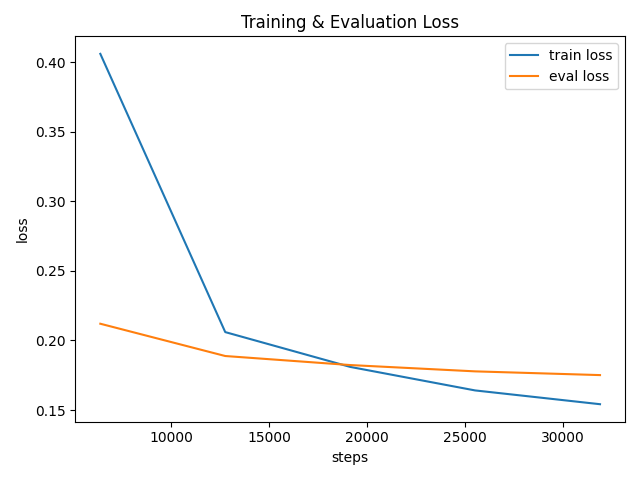
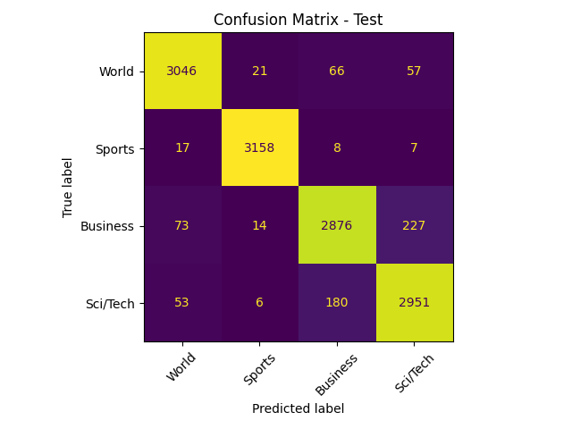

# Fine-Tuning BERT for News Classification

This project demonstrates the process of fine-tuning a pre-trained BERT model for a multi-class text classification task. The model is trained to classify news headlines into four distinct categories: World, Sports, Business, and Sci/Tech.

The project utilizes a parameter-efficient fine-tuning (PEFT) technique called LoRA (Low-Rank Adaptation) to significantly reduce the number of trainable parameters, making the fine-tuning process more efficient.

## Key Features

* [cite_start]**Model**: `bert-base-uncased` from the Hugging Face library[cite: 56].
* [cite_start]**Dataset**: AG News (`SetFit/ag_news`)[cite: 52].
* [cite_start]**Efficient Fine-Tuning**: Implements LoRA to fine-tune only ~1.21% of the model's parameters[cite: 60].
* [cite_start]**High Performance**: Achieves **94.29% accuracy** on the test set[cite: 66].
* **Modular Scripts**: Includes separate, well-documented scripts for training (`train.py`) and evaluation (`evaluate.py`).
* [cite_start]**Hardware Support**: Optimized for Apple Silicon (MPS) [cite: 62] and also supports CUDA or CPU.

## Model and Dataset

### Model Configuration
* [cite_start]**Backbone**: `bert-base-uncased` [cite: 56][cite_start], which has 12 layers, a hidden size of 768, 12 attention heads, and approximately 110 million parameters[cite: 59].
* [cite_start]**LoRA Adapters**: Fine-tuning is performed using LoRA adapters with a rank (`r`) of 8 and alpha of 16[cite: 60]. [cite_start]This results in only **1.34 million trainable parameters**[cite: 60].

### Dataset Details
* [cite_start]**Source**: The `SetFit/ag_news` dataset from Hugging Face[cite: 52].
* [cite_start]**Task**: 4-class news topic classification (World, Sports, Business, Sci/Tech)[cite: 53].
* [cite_start]**Splits**: The data was re-split into a stratified 80/10/10 ratio[cite: 52]:
    * [cite_start]**Train**: 102,080 samples[cite: 53].
    * [cite_start]**Validation**: 12,760 samples[cite: 53].
    * [cite_start]**Test**: 12,760 samples[cite: 53].
* [cite_start]**Preprocessing**: Text is tokenized using the WordPiece tokenizer with a maximum length of 128[cite: 54].

## Project Structure

```
.
├── data/
│   ├── train.csv
│   ├── val.csv
│   └── test.csv
├── outputs/bert_agnews/
│   ├── best_full_model/
│   ├── lora_adapter/
│   ├── confusion_matrix.png
│   ├── loss_plot.png
│   └── metrics.json
├── evaluate.py
├── train.py
├── requirements.txt
└── README.md
```

## Setup Instructions

1.  **Clone the Repository**
    ```bash
    git clone <your-repository-url>
    cd <repository-name>
    ```

2.  **Install Dependencies**
    [cite_start]All required packages are listed in `requirements.txt`[cite: 111].
    ```bash
    pip install -r requirements.txt
    ```

3.  **Prepare Data**
    * Create a `data/` directory in the project root.
    * Place your `train.csv`, `val.csv`, and `test.csv` files inside this directory. Each file must contain `text` and `label` columns.

## Usage

### 1. Train the Model
To start the fine-tuning process, run the `train.py` script. The script will train for 5 epochs and save the best model (based on evaluation loss) and LoRA adapter to the `outputs/bert_agnews/` directory.

```bash
python train.py
```

### 2. Evaluate the Model
After training, run the `evaluate.py` script to assess the model's performance on the test set.

```bash
python evaluate.py
```
This script will:
* Load the fine-tuned model.
* Calculate and print the final test metrics.
* Save the metrics to `outputs/bert_agnews/metrics.json`.
* Generate and save a confusion matrix plot to `outputs/bert_agnews/confusion_matrix.png`.

## Results and Evaluation

The model performs exceptionally well on the test set, demonstrating the effectiveness of LoRA-based fine-tuning.

### Performance Metrics

| Metric    | Score    |
| :-------- | :------- |
| Accuracy  | [cite_start]0.9429   [cite: 66] |
| Precision | [cite_start]0.9429   [cite: 67] |
| Recall    | [cite_start]0.9429   [cite: 68] |
| F1-score  | [cite_start]0.9428   [cite: 69] |
| Loss      | [cite_start]0.1824   [cite: 70] |

### Training & Evaluation Loss

The loss curves show stable convergence over the training process. The evaluation loss remains low, indicating that the model generalizes well without overfitting.



### Confusion Matrix

The confusion matrix highlights the model's strong predictive accuracy across all four classes. The diagonal values are significantly higher than the off-diagonal values, indicating few misclassifications. [cite_start]The most frequent confusion occurs between the 'Business' and 'Sci/Tech' categories, which is an expected challenge due to headline overlap[cite: 108].


